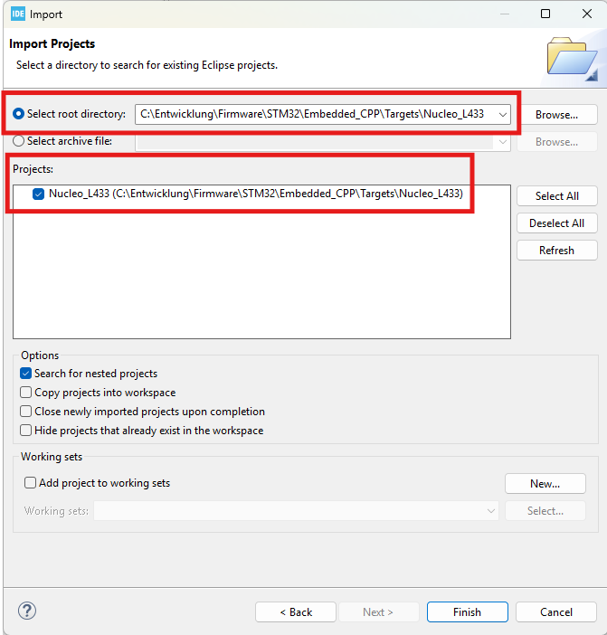
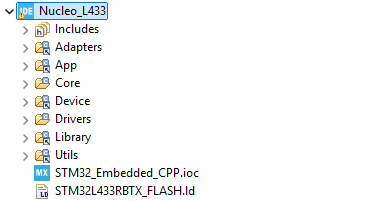
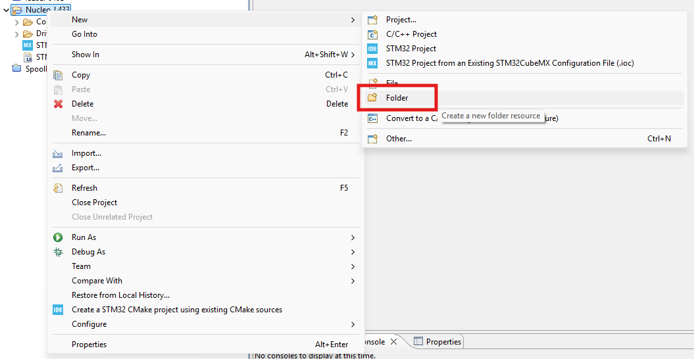
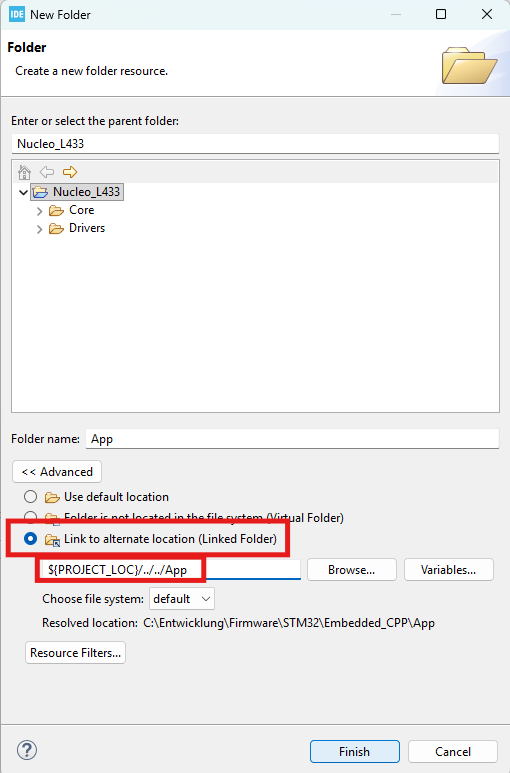
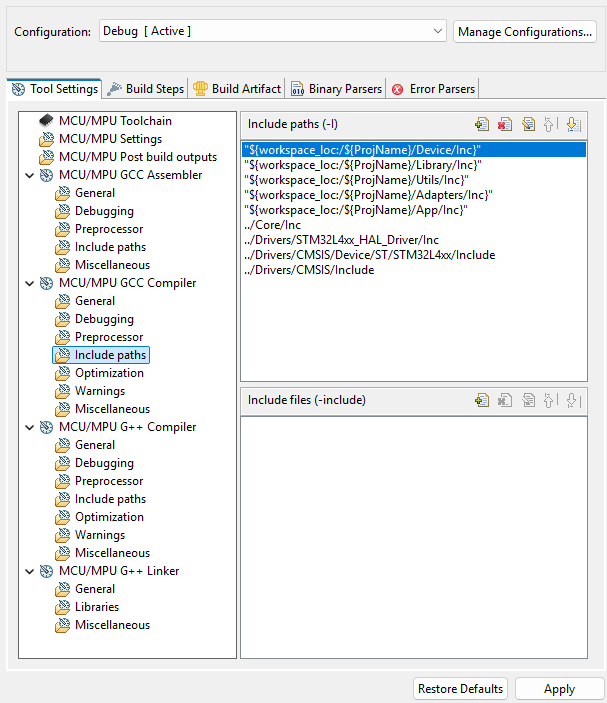
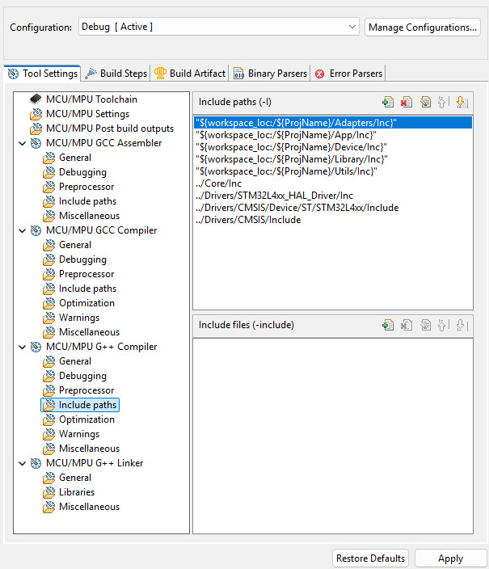

# STM32 Embedded C++ Framework 🚀

[](https://forthebadge.com) 
[](https://forthebadge.com) 
[](https://forthebadge.com) 
[](https://forthebadge.com)

## Overview

This repository demonstrates a clean, modern C++ architecture for embedded systems using STM32 microcontrollers. 
It decouples **application logic** and **C++ drivers** from the specific hardware capabilities and the STM32CubeIDE generated boilerplate.

The goal is to provide a portable, professional structure where C++ code remains board-agnostic, while STM32-specific configuration (generated by CubeMX) stays isolated in target folders.

## Architecture

This project uses a **Multi-Target Architecture**:

*   **`App/`**: Contains the high-level application logic. This code is 100% portable.
*   **`Device/`**: Contains C++ wrapper classes for peripherals (GPIO, USART, etc.). These classes do not include specific MCU headers directly but use an adapter layer.
*   **`Adapters/`**: The Hardware Abstraction Layer. `mcu_adapter.h` selects the correct Low-Level (LL) drivers based on the selected target.
*   **`Targets/`**: Contains board-specific implementations. Each folder here corresponds to a complete STM32CubeIDE project (including `.ioc`, `Core`, `Drivers` and startup code).

### Directory Structure

```text
/
├── App/                # Application Logic (Portable)
│   ├── Inc/
│   └── Src/
├── Device/             # C++ Drivers (Portable Wrappers)
│   ├── Inc/
│   └── Src/
├── Adapters/           # Hardware Abstraction Layer
│   └── Inc/
│       └── mcu_adapter.h
├── Library/            # 📚 External Libraries
├── Utils/              # 🛠 Helpers & C-to-C++ Bridge
└── Targets/            # 🎯 Board Specific Projects
    ├── Nucleo_L433/    # Complete CubeIDE Project for L433
    └── Nucleo_.../     # Future Targets
```

## Getting Started

### 1. Prerequisites
*   STM32CubeIDE (latest version recommended)
*   A supported Nucleo board (currently configured for **Nucleo-L433RC**)

### 2. Importing into STM32CubeIDE

⚠️ **Important**: Do not import the root folder!

1.  Open **STM32CubeIDE**.
2.  Select **File** > **Open Projects from File System...**.
3.  Click **Directory...** and navigate to `STM32_Embedded_CPP/Targets/Nucleo_L433`.
4.  Click **Finish**.



The project structure should look like this:



### 3. Setting up linked resources

Since the source code (`App`, `Device`) lives outside the project folder, you need to ensure the linked resources are set up correctly if they appear broken.
The project uses the variable `${PROJECT_LOC}` to refer to files relative to the target folder.

If folders `App`, `Device`, `Utils` are missing in the Project Explorer:
1.  Right-click the Project -> **New** -> **Folder**.

    

2.  Click **Advanced >>** -> Check **Link to alternate location (Linked Folder)**.

    

3.  Enter the location using the project variable:
    *   `App` -> `${PROJECT_LOC}/../../App`
    *   `Device` -> `${PROJECT_LOC}/../../Device`
    *   `Utils` -> `${PROJECT_LOC}/../../Utils`
    *   `Adapters` -> `${PROJECT_LOC}/../../Adapters`

4.  Add the Include paths to the project properties:
    *   For C Paths:

        

    *   For C++ Paths:

        
---

### 4. Build & Run
1.  Connect your Nucleo Board.
2.  Click **Run** (Green play button).
3.  The Application should blink the LED and print to UART/LPUART.

## How to Work with This Repo

### Modifying Application Code
Work primarily in the `App/` folder. This is where your main loop (`App_Run`), initialization (`App_Init`), and business logic reside.

### Adding New Drivers
Work in `Device/`. 
1.  Create your C++ wrapper class (`MyDriver.h/.cpp`).
2.  Include `mcu_adapter.h` instead of specific `stm32l4xx_ll_*.h` files.
3.  If a specific LL driver is missing, add it to `mcu_adapter.h`.

## Adding a New Board (Target)

1.  Create a new folder in `Targets/` (e.g., `Nucleo_F446`).
2.  Generate a new project using STM32CubeMX (or create a new STM32 Project in IDE) inside that folder.
3.  **Recommended**: Select "LL" (Low Layer) drivers for peripherals managed by `Device/` classes (like GPIO, UART) to maintain efficiency. However, you can mixed LL and HAL drivers if needed (e.g., using HAL for USB/Ethernet).
4.  **Setup Linked Resources & Includes**: Repeat the steps from **Getting Started -> 3. Setting up linked resources** to:
    *   Add the linked folders (`App`, `Device`, `Utils`, `Adapters`).
    *   Add the C and C++ Include Paths.
5.  Update `Adapters/Inc/mcu_adapter.h` to support the new MCU family (add `#ifdef STM32F4...`).

## Contributing

Contributions are welcome! If you port this to a new board, please submit a PR with the new folder in `Targets/`.

## License

MIT License. See [LICENSE](LICENSE) file for details.
